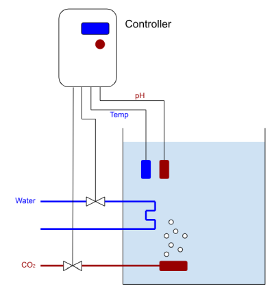

# Tank or PBR Controller with CO2

The primary use of the Symbrosia Controller is as a culture tank or photo-bioreactor controller.  In such a role the controller can monitor and control water temperature, pH, and potentially other parameters as needed.

With up to five sensors the conditions of a culture vessel can be throughly monitored.  This includes one water quality sensor (pH, ORP, or similar), two temperature sensors, and two general purpose analog sensors.  Likewise four outputs allow control of the usual tank or PBR conditions such as CO2 sparging and temperature control.

Documented here are the standard tank control boxes as used on the Symbrosia cultivation pads.  This is a control box built in a commonly available enclosure using standard parts.

A 3D printed frame is used to mount the various components into the enclosure in an organized and robust manner.  The use of standard DIN rail terminal blocks makes field wiring to sensors and valves easy to use and maintain.  CO2 sparging is handled using a built in valve and flow gauge.

## Arrangement

Any experienced aquaculture technician will find no surprises here, the controller is arranged exactly as one would expect.  In this case both temperature and pH control are implmented for use in algae culture.

Temperature control may be implemented with cool water circulating through a heat exchanger (as shown in the figure), direct addition of cool water, or conversely by use of a heater to warm rather than cool if the need demands.  In any case one of the controller relays can be used to actuate this control.  The onboard relays are rated at 240Vac and 5A, if a larger load such as a large heater or pump is required the onboard relay may be used to control a larger relay or contactor.

As shown, pH control is implemented in a very traditional manner, simply monitoring with a pH probe and when needed sparging CO2 directly into the PBR or tank.

Built as documented below the controller should be capable of controlling tanks from a few tens of liters to a few thousand liters.  Larger tanks will require larger valves to allow more flow and well considered placement of sensors.  If two temperature sensors are needed in a large tank the Symbrosia Controller can be configured to min/max or average the two readings and use the result.

## Documentation

* [Schematic and parts](025-030SymbCtrlPBRController.pdf)
* [OpenSCAD source file]()
* [3D models ready for slicing](025-055SymbCtrlSubframeModel.zip)
  * [Upper Subframe](025-056SubframeUpper.stl)
  * [Lower Subframe](025-057SubframeLower.stl)
  * [DIN End Block](025-059TBlockEnd.stl)
  * [Control Knob](025-058ControlKnob.stl)
  * [Drill Guide](DrillGuide.stl)
* [Sample configuration file](StandardTank.xml)

The sample configuration file can be loaded into the controller using SyView.  This configuration assumes that the various accessories are connected to the controller as shown in the controller schematic above.

## Purchasing

All the needed parts can be purchased through the usual online vendors...

* Electronic components - Digikey (www.digikey.com) or Mouser (www.mouser.com)
* PCB - JLCPCB (www.jlcpcb.com) or Advanced PCB (www.advancedpcb.com)
* Valve - WIC Valve [2ACK-1/4-12VDC-G](https://wicvalve.com/product/1-4-inch-fast-response-air-water-electric-solenoid-valve-nc/)
* Flow Gauge - Omega [FL-2002](https://www.omega.com/en-us/flow-instruments/flow-meters/variable-area-flow-meters/fl2000-series/p/FL-2002) or Dwyer [VFA-23](https://dwyer-inst.com/en/products/flow/flowmeters/series-vf-visi-floatr-acrylic-flowmeter.html)
* Enclosure - Home Depot [Serpac I342HL](https://www.homedepot.com/p/Serpac-11-8-in-L-x-10-2-in-W-x-5-5-in-H-Cabinent-Enclosure-Polycarbonate-Clear-Hinged-Latch-Top-Gray-Bottom-I342HL-TCBG/303702896)

Note that the flow meter model needed may require checking against the size of tank or PBR and the CO2 flow rates needed to control pH.

## 3D Printing

Many standard 3D printers can print the parts needed for the design shown here with a couple considerations...

* While PLA is the most popular filament to print, it is easy, very forgiving, and cheap, the problem is that PLA can soften and distort in a hot environment.  Some early prototypes of the Symbrosia Controller suffered this fate when the enclosures sat in Hawaiian sunlight.  All parts should be printed in ABS, PETG, ASA, or some other heat tolerant filament.  These materials take a bit more work and understanding to print.
* The largest part is 207mm x 143mm, some of the smaller printers cannot accomodate a part this large.   Check your printer build plate size, many of the most popular modern printers will have no issues (Ender 3, Bambu X1, Prusa i3 MK3, etc.).

## Construction

## Use Considerations

This controller has been in use for some years now, with a large number constructed and in use in multiple aquaculture facilites.  While it has served well, a few things have been noted...

* In order to prevent corrosion and damage to the electronics the enclosure is normally sealed, all wiring made through cable glands that prevent any water ingress.  There is a price to this, the enclosure interior can get quite hot when in full sunlight.  Some provision must be made to shade the unit, either mounting in a shaded location or providing a simple cover that can be used to keep sunlight off the case, particularly keeping sunlight from shining into the clear cover. This can be seen in the photo above.
*  It is desirable to mount the controller above water level.  This addresses two issues, it prevents water from coming in the CO2 tubing through the sparger thus preventing damage to the CO2 supply valve.  We have also found the tanks and PBR's full of seawater make excellent WiFi signal blockers.  Keeping the controllers above tank level provides clear line-of-sight to the WiFi access points mounted on poles around our cultivation area.
*  Seawater and electrical power are a dangerous combination.  Around the Symbrosia cultivation area 120V power is carefully handled.  All receptacles are installed 3ft or higher off the ground to reduce the chance of spray or splashing, all outlets are covered by in-use receptacles.  While the controllers take 120V in, no output connection (sensors, valves, etc.) uses greater than 12Vdc.  Thus the majority of wiring around the tanks and PBR's is kept at a safe voltage.  We typically install a larger 12Vdc @ 6A (72W) power supply in the control boxes to provide ample power for valves and other accessories.
